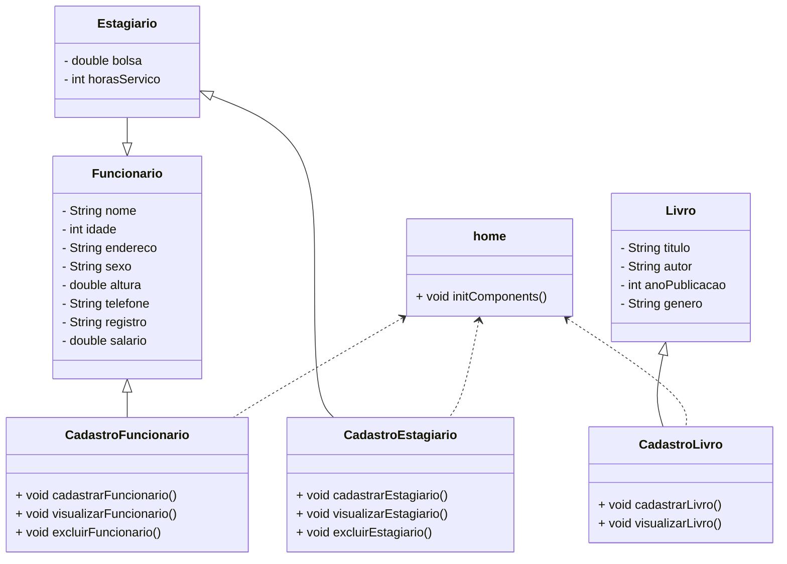

# Diagrama UML

```mermaid
classDiagram
    class Funcionario {
        - String nome
        - int idade
        - String endereco
        - String sexo
        - double altura
        - String telefone
        - String registro
        - double salario
    }

    class Estagiario {
        - double bolsa
        - int horasServico
    }
    Estagiario --|> Funcionario

    class Livro {
        - String titulo
        - String autor
        - int anoPublicacao
        - String genero
    }

    class CadastroFuncionario {
        + void cadastrarFuncionario()
        + void visualizarFuncionario()
        + void excluirFuncionario()
    }

    class CadastroEstagiario {
        + void cadastrarEstagiario()
        + void visualizarEstagiario()
        + void excluirEstagiario()
    }

    class CadastroLivro {
        + void cadastrarLivro()
        + void visualizarLivro()
    }

    class home {
        + void initComponents()
    }

    Funcionario <|-- CadastroFuncionario
    Estagiario <|-- CadastroEstagiario
    Livro <|-- CadastroLivro
    home <.. CadastroFuncionario
    home <.. CadastroEstagiario
    home <.. CadastroLivro
```
