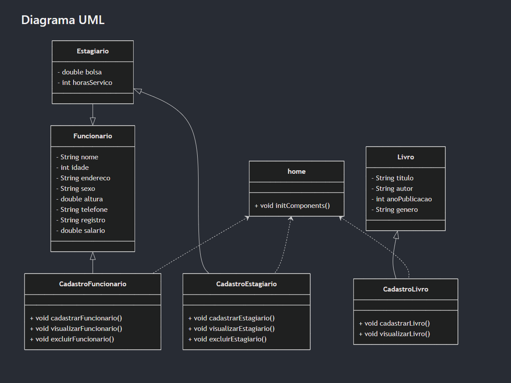

# Trabalho Final POO

## Descrição da Aplicação

Esta aplicação foi desenvolvida como parte do Trabalho Final da disciplina de Programação Orientada a Objetos (POO). O objetivo principal é gerenciar cadastros de funcionários, estagiários e livros, permitindo operações de cadastro, visualização e exclusão de registros.

## Funcionalidades

- **Cadastro de Funcionários**: Permite cadastrar, visualizar e excluir funcionários.
- **Cadastro de Estagiários**: Permite cadastrar, visualizar e excluir estagiários.
- **Cadastro de Livros**: Permite cadastrar e visualizar livros.

## Estrutura do Projeto

O projeto está organizado em pacotes conforme descrito abaixo:

- **model**: Contém as classes de modelo que representam os dados da aplicação.
- **view**: Contém as classes de interface gráfica para interação com o usuário.

## Instruções de Uso

### Requisitos

- Java Development Kit (JDK) 8 ou superior
- IDE de sua preferência (Eclipse, IntelliJ, NetBeans, etc.)

### Passos para Execução

1. **Clone o repositório**:
    ```bash
    git clone 
    ```

2. **Importe o projeto na sua IDE**:
    - Abra a sua IDE.
    - Importe o projeto como um projeto Java existente.

3. **Compile e execute a aplicação**:
    - Compile o projeto.
    - Execute a classe `home` para iniciar a aplicação.

### Utilização

1. **Cadastro de Funcionários**:
    - Navegue até o menu "Funcionário" e selecione "Cadastro".
    - Preencha os dados solicitados e clique em "Cadastrar".

2. **Cadastro de Estagiários**:
    - Navegue até o menu "Estagiário" e selecione "Cadastro".
    - Preencha os dados solicitados e clique em "Cadastrar".

3. **Cadastro de Livros**:
    - Navegue até o menu "Biblioteca" e selecione "Cadastro de Livros".
    - Preencha os dados solicitados e clique em "Cadastrar".

## Diagrama UML



### Classes Utilizadas

- **Funcionario**: Representa um funcionário com atributos como nome, idade, endereço, sexo, altura, telefone, registro e salário.
- **Estagiario**: Extende a classe Funcionario e adiciona atributos específicos como bolsa e horas de serviço.
- **Livro**: Representa um livro com atributos como título, autor, ano de publicação e gênero.
- **CadastroFuncionario**: Classe responsável por gerenciar o cadastro de funcionários.
- **CadastroEstagiario**: Classe responsável por gerenciar o cadastro de estagiários.
- **CadastroLivro**: Classe responsável por gerenciar o cadastro de livros.
- **home**: Classe principal que inicializa a interface gráfica da aplicação.

## Conclusão

Esta aplicação fornece uma interface simples e intuitiva para gerenciar cadastros de funcionários, estagiários e livros. Siga as instruções acima para configurar e utilizar a aplicação.
